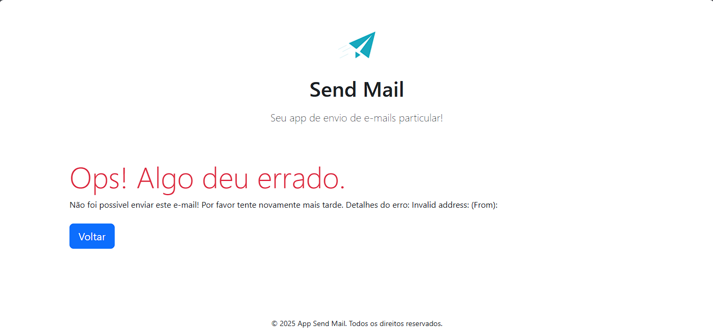

# 📧 App Send Mail - Seu Solução Simplificada para Envio de E-mails

**Envie e-mails de forma rápida, segura e elegante!**  
O App Send Mail é uma ferramenta desenvolvida para simplificar o envio de e-mails com um toque profissional. Ideal para uso pessoal ou integração em sistemas existentes!

<div align="center">

   []()  

</div>

## ✨ Recursos Incríveis

### 🚀 **Envio Simplificado**
- Formulário intuitivo com campos para **Destinatário, Assunto e Mensagem**
- Validação em tempo real de campos obrigatórios
- Suporte a conteúdo HTML nas mensagens

### 🛡️ **Segurança e Confiabilidade**
- Integração com **PHPMailer** para envio via SMTP
- Conexão criptografada TLS (Gmail compatível)
- Tratamento de erros detalhado para diagnóstico

### 🌐 **Experiência Moderna**
- Design responsivo com **Bootstrap 5**
- Compatível com PWA (Progressive Web App)
- SEO otimizado com metatags e schema básico
- Favicon multi-plataforma e Web Manifest

### 💡 **Feedback Visual**
- Telas dinâmicas de **sucesso** e **erro**
- Mensagens claras e ações pós-envio
- Botão de retorno automático ao formulário

---

## 📸 Telas do Sistema

### 1. Formulário Principal
  
*Interface limpa e focada na ação principal*

---

### 2. Feedback de Sucesso
  
*Confirmação visual com destaque em verde*

---

### 3. Tratamento de Erros
  
*Detalhamento técnico para troubleshooting*

---

## ⚙️ Tecnologias Utilizadas

| Camada          | Tecnologias                                  |
|-----------------|---------------------------------------------|
| **Frontend**    | HTML5, Bootstrap 5, CSS3, PWA               |
| **Backend**     | PHP 8+, PHPMailer 6.8+                      |
| **Segurança**   | SMTP Auth, TLS Encryption                   |
| **Infra**       | SMTP (Gmail compatível), Web Server Apache/Nginx |

---

## 🚀 Como Usar

### Pré-requisitos
- PHP 8.0+
- Servidor SMTP configurado (ex: Gmail)
- Composer (para dependências)

### Instalação
```bash
# Clone o repositório
git clone https://github.com/seu-usuario/send-mail-app.git

# Instale dependências
composer require phpmailer/phpmailer

# Configure o SMTP (process_submission.php)
$mail->Username = 'seu@email.com';
$mail->Password = 'sua_senha_app';
$mail->setFrom('seu@email.com', 'Seu Nome');
```

### Fluxo de Trabalho
1. Acesse `index.php`
2. Preencha os campos obrigatórios:
   - 📩 Destinatário válido
   - ✏️ Assunto claro
   - 📝 Mensagem (suporte HTML)
3. Clique em **"Enviar Mensagem"**
4. Receba feedback imediato do sistema

---

## 🤝 Contribuição

1. Faça o Fork do projeto
2. Crie sua Branch (`git checkout -b feature/nova-funcionalidade`)
3. Commit suas mudanças (`git commit -m 'Add nova funcionalidade'`)
4. Push para a Branch (`git push origin feature/nova-funcionalidade`)
5. Abra um Pull Request

---

## 📄 Licença

MIT License - Consulte o arquivo [LICENSE](LICENSE) para detalhes.

---

## 👨💻 Autor

**Danilo Antunes**  
[](https://www.linkedin.com/in/dan-de-jesus/)

---

> **Nota:** Para uso com Gmail, ative "Aplicativos menos seguros" ou gere uma **Senha de App** nas configurações da conta Google.